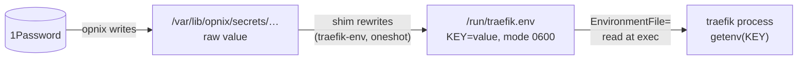

# Env Shims

How a secret travels from `opnix` into a service's environment, and where that chain breaks.

## The Problem

`opnix` writes each secret as a raw value into `/var/lib/opnix/secrets/<name>`.
Some services, Traefik among them, accept a credential only as an environment variable.
The nix store is world-readable, so the value cannot sit in `Environment=`.
Something must turn the raw file into a `KEY=value` line at runtime.

## The Shim

A shim is a `Type=oneshot` unit with `RemainAfterExit=true` that does that conversion once, at boot.

The consumer names the env file: `services.traefik.environmentFiles` in `homelab.nix`. systemd reads that file when it launches the process and injects the variables before `exec`.
The process keeps its environment in memory from then on.
Rewriting the file changes nothing for a running process.
Only the next start re-reads it.

## Dependencies

The shim declares `before` the consumer.
The consumer declares `after` and `requires` the shim.
At boot the shim runs first, then the consumer starts.

`RemainAfterExit=true` leaves the shim `active (exited)` after its one run.
That satisfies `Requires=` forever.
The consumer can restart at any time without the shim re-running.
Nothing re-runs a shim except a reboot, an explicit restart, or a rebuild that changes its definition.

## The Refresh Gap

Boot coupling is not refresh coupling.

- Restart the consumer alone: the shim stays `active (exited)`, and the env file keeps its boot-time value.
- Restart the shim alone: `Requires=` stops the consumer, and `try-restart` does not start it again.

So a rotated secret reaches the raw file and stops.
The env file and the running process keep the old value until someone restarts both units, in order, by hand.

## `PartOf=`

`PartOf=` adds the missing edge.
`partOf = [ "<shim>" ]` on the consumer propagates a stop or restart of the shim to the consumer, as one ordered operation.
Nothing else propagates: a start of either unit leaves the other untouched.
"Restart the shim" then refreshes the pair, and `opnix` can name the shim alone in a secret's `services` list.

## Failure Modes

- A shim only fails when started, so a broken shim never hurts a running consumer.
  The break surfaces at the next consumer start, far from its cause.
- `echo "KEY=$(cat file)" > env` succeeds even when the `cat` fails.
  The shim reports success, writes an empty value, and the next consumer start holds a dead credential with no failed unit anywhere.

## Alternatives

- `ExecStartPre` on the consumer runs the same glue on every start.
  "Restart the consumer" then refreshes the value, with no second unit.
- `LoadCredential=` hands the service the secret in `$CREDENTIALS_DIRECTORY` at each start.
- A `<VAR>_FILE` variable names a path the program reads itself.
  Traefik's ACME library documents it, but nobody has verified it here.
