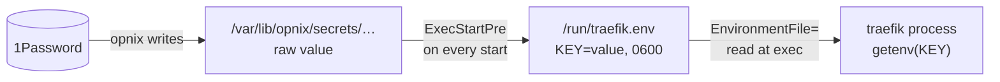

# Secret Env Files

How a secret travels from `opnix` into a service's environment.

## The Problem

`opnix` writes each secret as a raw value into `/var/lib/opnix/secrets/<name>`.
Some services, Traefik among them, accept a credential only as an environment variable.
The nix store is world-readable, so the value cannot sit in `Environment=`.
Something must turn the raw file into a `KEY=value` line at runtime.

## The Solution

An `ExecStartPre` command on the consumer does the conversion on every start:

The command has a `+` prefix, so it alone runs as root while the daemon stays unprivileged.
The secret and the env file stay root-only. systemd reads `EnvironmentFile=` itself and injects the variables before `exec`, so the process opens neither file.

A process keeps its environment from `exec` onward, so a rewritten env file reaches nothing that already runs.
Because the conversion runs on every start, "restart the service" always picks up the current secret.

## Refresh on Rotation

Each secret names its consumers in `services` on its `opnix` declaration.
When a poll finds a changed value, `opnix` rewrites the file and runs `systemctl try-restart` on the units that `services` lists.
The restart runs `ExecStartPre` again, which completes the chain.
