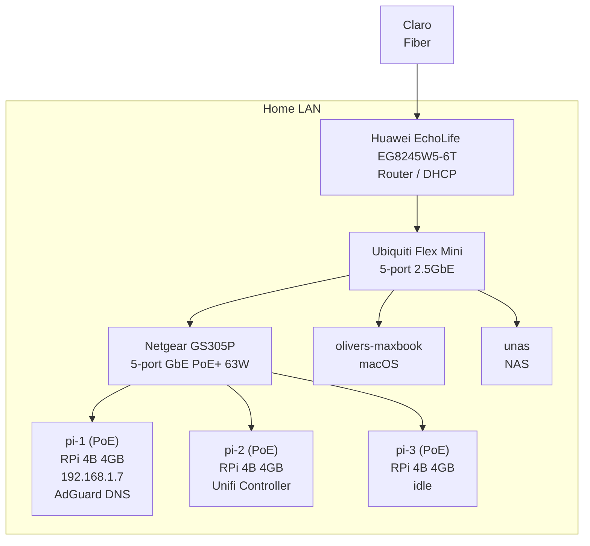

# Homelab Architecture

## Physical layout

How devices are connected at the network hardware level.

## Tailscale overlay

All devices are members of the `your-tailnet.ts.net` tailnet and can reach each other directly over WireGuard.

- Client devices
  - `olivers-maxbook` (macOS)
  - `iphone-13-mini` (iOS)
  - `ipad` (iOS)
- `tag:bramble`
  - `pi-1` (NixOS)
  - `pi-2` (NixOS)
  - `pi-3` (NixOS)
  - `unas` (NixOS)

## DNS and HTTPS

Local domain: `home.lan`. This is a private domain that does not exist on the public internet - it only resolves because AdGuard on `pi-1` handles DNS and rewrites `*.home.lan` names locally. Without a custom DNS resolver, no client would be able to find these services.

**On LAN:** the Huawei router does not support custom DNS via DHCP. As a workaround, `pi-1`'s LAN IP is hardcoded as the DNS resolver in `olivers-maxbook`'s network settings. A query for `*.home.lan` returns `pi-1`'s LAN IP.

**Over Tailscale:** not yet configured. To make `home.lan` resolve remotely, Tailscale needs a custom DNS resolver pointing to AdGuard on `pi-1`'s Tailscale IP.

In both cases traffic terminates at Traefik on `pi-1`, which routes to the correct service by `Host` header. Clients must import the self-signed cert to trust the HTTPS connection.
